# Hi, I'm Max 👋

### QE at AuditBoard. I break things on purpose, then make sure they stay broken-proof.

 

come with me if you want to ship 🕶️

 

---

how the animation works

 

`venice-terminator.svg` is generated, not hand-written. Run `python3 build.py > venice-terminator.svg`.

**Art sources.** Sprites where every pixel matters live in `art/*.txt` as ASCII grids —
one character per pixel, `.` is transparent, characters map to hex through
`palette.json`. `skull.txt` and `fedora.txt` are left halves only, mirrored at build
time. Everything geometric (sky, sea, sand, palm trunks, fronds, the shirt) is drawn
procedurally in `build.py`, because hand-typing a 160×90 grid is silly.

**Output.** A 160×90 pixel grid in a `viewBox`, so it stays crisp at any width. Adjacent
same-colour pixels are run-length merged into single `<rect>`s, which also resolves
overdraw. ~3.1k rects.

**Animation is pure CSS.** GitHub serves README images through a proxy and renders them
in an ``, so JavaScript never runs — only CSS and SMIL do. Every ambient loop uses
`steps()` timing to swap discrete sprite frames, because interpolating pixel art puts
pixels on half-coordinates and blurs the grid. The one continuous motion, the cloud
scroll, is quantised with `steps(160)` so it advances exactly one grid pixel at a time.

The camera cut is 2× → 1× in a single hard jump. Only integer factors preserve the pixel
grid, and 8-bit games cut rather than zoom anyway.

| Time | Beat |
|---|---|
| 0–2s | Black. Chrome skull at 2×, dim, optic pulsing |
| 2–4s | Curtain wipes right; hard cut to 1×; figure lights up |
| 4–5.5s | Sunglasses drop in |
| 5.5–7s | Hawaiian shirt slides on |
| 7–8.5s | Fedora drops |
| 8.5s → | Hold. Five ambient loops keep running |

One-shots run `iteration-count: 1` with `fill-mode: both`, so the final frame holds.
Ambient loops (palm sway ×2 trees, ocean rollers, shoreline foam, cloud drift, optic
glow) run `infinite` on deliberately non-harmonic periods — 1.2 / 1.5 / 0.5 / 3.1 / 1.8 /
40 seconds. Shared factors would make the whole scene visibly pulse in unison.

Because the timeline restarts whenever the image loads, the transformation replays once
per page view.

**Checks.** `python3 test_build.py` verifies the sprite grids are rectangular, the
palette is exact with no dead entries, the SVG parses, and every `#id` the CSS animates
actually exists. It does not assert the art looks right — that is settled by rendering it
and looking.

**Tweaking.** Colours are all in `palette.json`. Shapes are ASCII: nudge a few characters
in `art/shades.txt` and rebuild.

