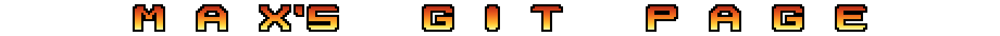

<div align="center">





</div>

<br>

---

<details>
<summary><sub>how these are built</sub></summary>

<br>

Both SVGs are generated by one script:

```bash
python3 build.py         > venice-beach.svg
python3 build.py --title > title.svg
python3 test_build.py                       # 7 structural checks
```

## The title

**Gradient text cannot be done with CSS here.** GitHub strips `<style>` blocks and
`style` attributes from README markdown, so the gradient has to live inside an SVG.

**The letterforms are hand-drawn pixels, not a font.** An SVG loaded through an ``
cannot fetch external fonts, so naming a typeface would only work for viewers who already
have it installed. The glyphs are ASCII art in the `FONT` dict in `build.py`, on a 13x11
grid with 3px strokes — ten of them, which is every distinct character in the title.
Nothing to download, nothing to license, and the arcade look wants visible pixels anyway.

Chamfered corners are what separate an arcade face from a plain blocky one. They are cut
into the art on the corners that should have them. Deriving them programmatically, by
removing every outer convex corner pixel, was tried first and failed badly: with 3px
strokes it eats both ends of every stroke and every diagonal step, eroding the letters
into fragments.

The **outline is an 8-connected dilation of the ink**, computed at build time, so it wraps
the letterforms exactly. Stroking the SVG instead would outline every individual `<rect>`
and produce a grid of boxes.

The fire ramp runs dark red through orange to pale yellow across the cap height, as one
`linearGradient` in `userSpaceOnUse` so the colour bands line up across every letter
rather than restarting per glyph. Unlike chrome type there is no hard break — the
continuous fall is the whole effect.

The strip always renders at 100% of the README column, so **letter size is set purely by
how many grid units wide the `viewBox` is**. More units means each unit is fewer screen
pixels, so the glyphs shrink. `TITLE_W = 460` puts the text at roughly 40% of the width
with caps near 22px on a typical column; lower it to grow the letters, raise it to shrink
them further. No glyph redrawing involved.

Tracking is separate from size: `GAP` sets the space between letters and `SPACE_W` the
space between words, so the letters can stay small while the text still spans the strip.
`TIGHT` overrides both around the apostrophe, so `MAX'S` reads as one word instead of
three glyphs adrift.

The background is transparent (`TITLE_BG = "none"`), so the strip blends into either
GitHub theme rather than only the dark one. The black outline is what makes that work: it
carries the letters against white as well as it does against a dark canvas.

To change the wording, edit `TITLE_TEXT` and add any missing glyph to `FONT`. A test
fails if a character has no glyph.

## The beach

**Fully procedural** — no sprite files. A 320×40 pixel grid in a `viewBox`, rendered at
scale 3 (960×120). Doubling the grid halved the apparent pixel size without changing the
rendered dimensions. Adjacent same-colour pixels are run-length merged into single
`<rect>`s, which also resolves overdraw. 1785 rects, 77 KB, 20 colours.

**Nothing plays once.** Every animation is an infinite loop, asserted by a test:

| Element | Frames | Period | What the period measures |
|---|---|---|---|
| Palm fronds, near tree | 4 | 2s | one full sway cycle |
| Palm fronds, far tree | 4 | 2.5s | one full sway cycle |
| Ocean crests | 4 | 1.5s | one full crest cycle |
| Shoreline foam | 4 | 3.1s | one advance and retreat |
| Cloud drift | scrolled | 18s | one full 320px wrap |

The last row is a different unit from the rest, which is worth spelling out. The frame
sets cycle four discrete sprites, so their period is one cycle. The clouds instead
translate continuously across twice the canvas width, so their period is a full traverse.
18s reads as a visible drift; the same number used as if it were a frame period would
send the clouds across the banner in about a second and a half, which looks like a gale.

Frame periods are deliberately non-harmonic. 2 / 2.5 / 1.5 / 3.1 only re-sync every 30
seconds, so nothing visibly pulses in unison. Giving two elements the same period locks
them in step, which is why the clouds do not reuse the crest value.

Every loop uses `steps()` timing to swap discrete frames, because interpolating pixel art
puts pixels on half-coordinates and blurs the grid. The cloud scroll is quantised with
`steps(320)` so it advances exactly one grid pixel at a time, and that layer is tiled to
twice the canvas width so the wrap is seamless.

**Palm fronds** are sampled quadratic Bézier spines with thickness tapering from base to
tip. Advancing one column per iteration and drawing vertical runs instead merges the
blades into a flat mushroom cap. A `wind` offset swapped across four frames animates the
sway, running back and forth (`-4, 0, +4, 0`) so the loop never snaps.

## Checks

`test_build.py` asserts the palette is exact with no dead entries, the SVG parses, every
`#id` the CSS animates exists, every animation is `infinite`, no layer paints off-canvas,
the title parses with one path per letter, and the title gradient spans the cap height.

Two of those are regression guards for bugs that actually happened: a palm crown whose
top frond was being clipped by the viewBox, and a gradient measured in the wrong
coordinate space — it is referenced from inside the translated glyph group, so its
`userSpaceOnUse` coordinates live in *that* space. Measuring from the outer space put the
whole ramp below the letters and rendered them solid white.

None of the checks assert the art looks right. That is settled by rendering it and
looking.

## Tweaking

Colours are in `palette.json` (beach) and the `CHROME` table in `build.py` (title).
Geometry is constants near the top of `build.py`: `W`/`H` for the canvas,
`HORIZON`/`SHORE`/`SAND` for the bands, `TREES` for palm placement.

</details>
