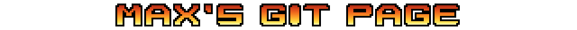

<div align="center">




### :sunglasses: QE at AuditBoard. I break things on purpose, then make sure they stay broken-proof. :sunglasses:

</div>

<br>

---

<details>
<summary><sub>how these are built</sub></summary>

<br>

Both SVGs are generated by one script:

```bash
python3 build.py         > venice-beach.svg
python3 build.py --title > title.svg
python3 test_build.py                       # 7 structural checks
```

## The title

**Gradient text cannot be done with CSS here.** GitHub strips `<style>` blocks and
`style` attributes from README markdown, so the gradient has to live inside an SVG.

**The typeface is baked to paths.** An SVG loaded through an `` cannot fetch external
fonts, so `font-family="Impact"` would only render as Impact for viewers who already have
it — everyone else silently gets a fallback. So the glyphs were outlined once from Impact
with `tools/outline.py` in a throwaway venv, and the resulting `<path>` data is committed
as `title-glyphs.json` (12 glyphs, 4 KB). The repo needs no font files and no `fontTools`
at build time, and the type renders identically everywhere.

To change the wording you need to re-outline, because only the glyphs in the current
string are stored:

```bash
python3 -m venv /tmp/fv && /tmp/fv/bin/pip install fonttools
/tmp/fv/bin/python tools/outline.py "NEW TITLE" 100 0.055 > /dev/null
```

Only the outlines of a dozen letters are committed, not the font — the same thing any
outlined logo does. Swap in a libre face if you want to be strict about it.

**The chrome look is one trick: a hard horizontal break at the midline.** White → pale
blue → navy on top, then an abrupt stop to near-black violet, brightening back to white
at the foot. A smooth blue-to-violet ramp reads as a soft gradient, not as chrome. A
white outline sits behind the fill via `paint-order="stroke"`, so the letters keep their
full weight instead of being eaten into.

## The beach

**Fully procedural** — no sprite files. A 320×40 pixel grid in a `viewBox`, rendered at
scale 3 (960×120). Doubling the grid halved the apparent pixel size without changing the
rendered dimensions. Adjacent same-colour pixels are run-length merged into single
`<rect>`s, which also resolves overdraw. 1785 rects, 77 KB, 20 colours.

**Nothing plays once.** Every animation is an infinite loop, asserted by a test:

| Element | Frames | Period | What the period measures |
|---|---|---|---|
| Palm fronds, near tree | 4 | 2s | one full sway cycle |
| Palm fronds, far tree | 4 | 2.5s | one full sway cycle |
| Ocean crests | 4 | 1.5s | one full crest cycle |
| Shoreline foam | 4 | 3.1s | one advance and retreat |
| Cloud drift | scrolled | 18s | one full 320px wrap |

The last row is a different unit from the rest, which is worth spelling out. The frame
sets cycle four discrete sprites, so their period is one cycle. The clouds instead
translate continuously across twice the canvas width, so their period is a full traverse.
18s reads as a visible drift; the same number used as if it were a frame period would
send the clouds across the banner in about a second and a half, which looks like a gale.

Frame periods are deliberately non-harmonic. 2 / 2.5 / 1.5 / 3.1 only re-sync every 30
seconds, so nothing visibly pulses in unison. Giving two elements the same period locks
them in step, which is why the clouds do not reuse the crest value.

Every loop uses `steps()` timing to swap discrete frames, because interpolating pixel art
puts pixels on half-coordinates and blurs the grid. The cloud scroll is quantised with
`steps(320)` so it advances exactly one grid pixel at a time, and that layer is tiled to
twice the canvas width so the wrap is seamless.

**Palm fronds** are sampled quadratic Bézier spines with thickness tapering from base to
tip. Advancing one column per iteration and drawing vertical runs instead merges the
blades into a flat mushroom cap. A `wind` offset swapped across four frames animates the
sway, running back and forth (`-4, 0, +4, 0`) so the loop never snaps.

## Checks

`test_build.py` asserts the palette is exact with no dead entries, the SVG parses, every
`#id` the CSS animates exists, every animation is `infinite`, no layer paints off-canvas,
the title parses with one path per letter, and the title gradient spans the cap height.

Two of those are regression guards for bugs that actually happened: a palm crown whose
top frond was being clipped by the viewBox, and a gradient measured in the wrong
coordinate space — it is referenced from inside the translated glyph group, so its
`userSpaceOnUse` coordinates live in *that* space. Measuring from the outer space put the
whole ramp below the letters and rendered them solid white.

None of the checks assert the art looks right. That is settled by rendering it and
looking.

## Tweaking

Colours are in `palette.json` (beach) and the `CHROME` table in `build.py` (title).
Geometry is constants near the top of `build.py`: `W`/`H` for the canvas,
`HORIZON`/`SHORE`/`SAND` for the bands, `TREES` for palm placement.

</details>
